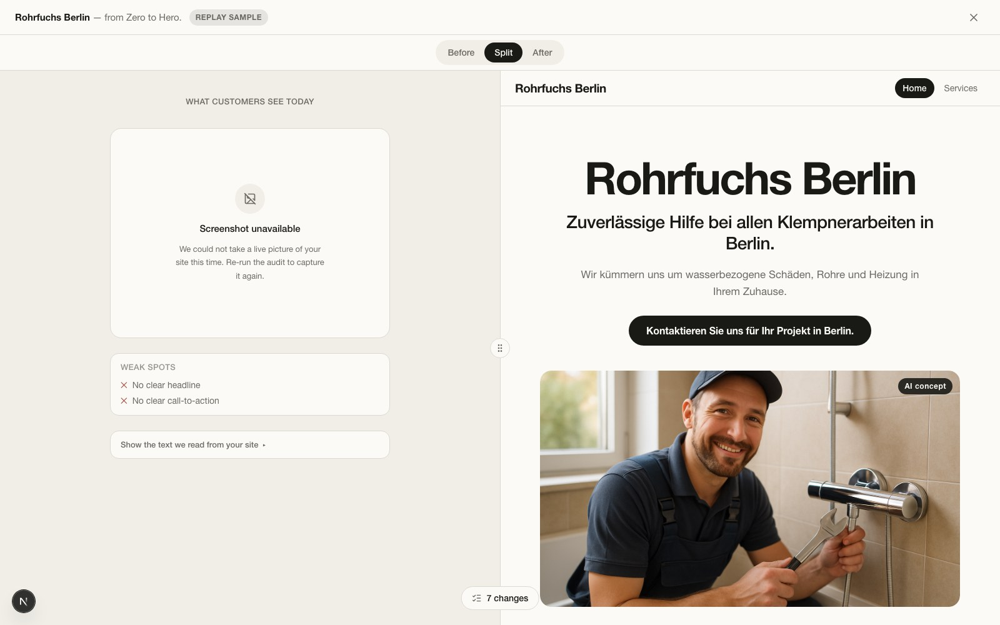
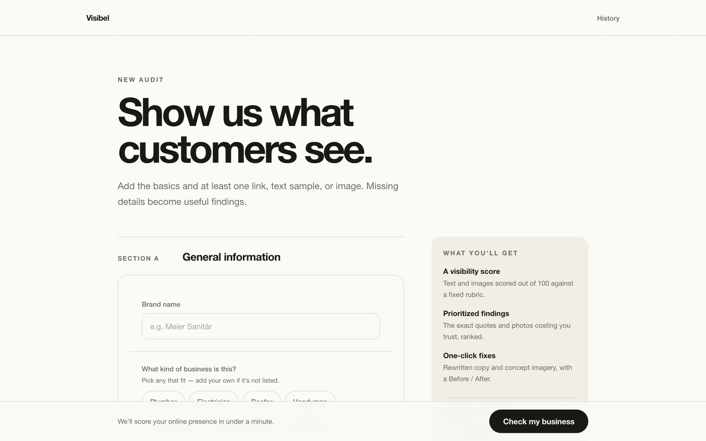
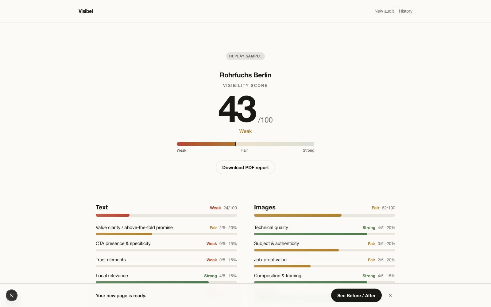
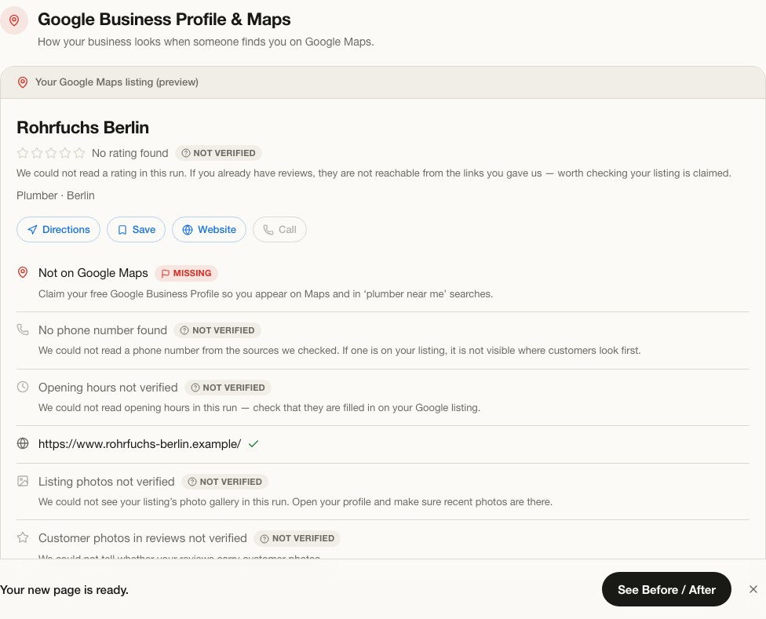
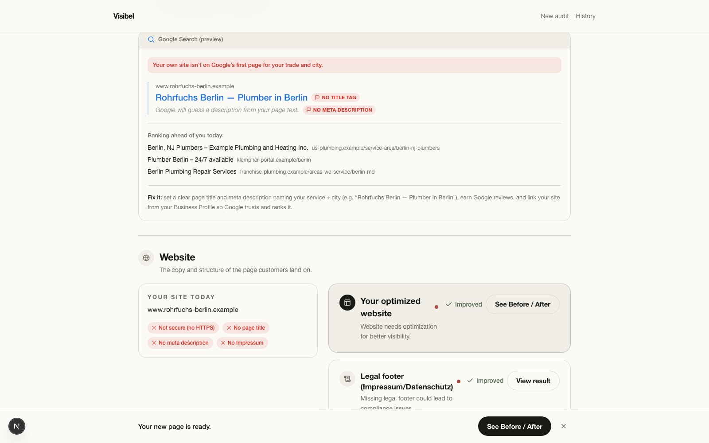
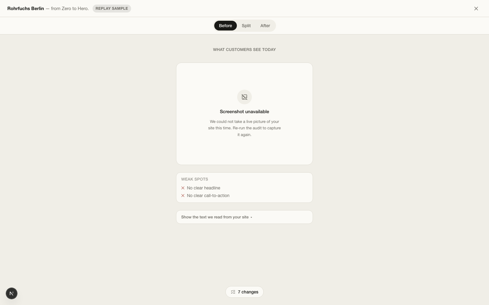
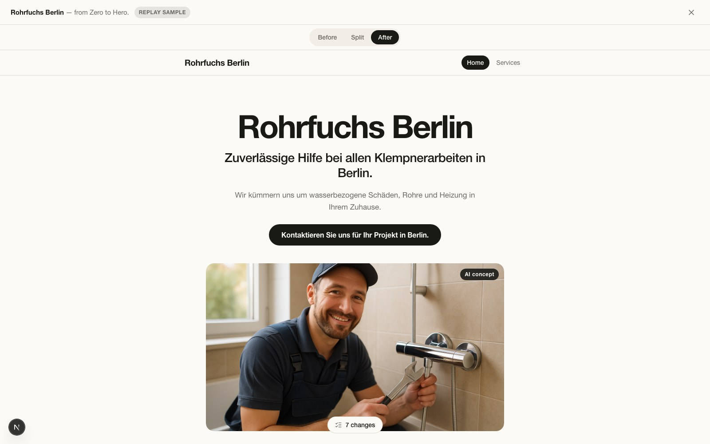
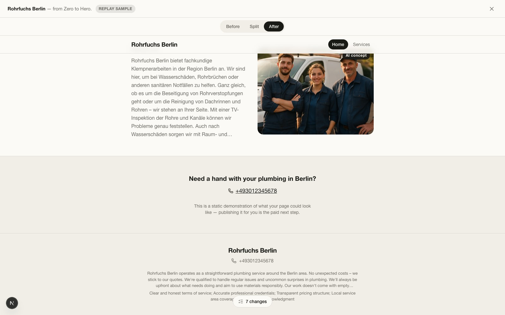

<div align="center">

<picture>
  <source media="(prefers-color-scheme: dark)" srcset="docs/media/readme/wordmark-dark.svg" />
  
</picture>

**From zero to hero.**

Audit how customers actually see a local business online — then rebuild it in one click.

[](https://joevonlong.github.io/Visibel--Online-marketing-Coach/)

<br/>


<br/>


<p>
  <a href="https://joevonlong.github.io/Visibel--Online-marketing-Coach/" target="_blank"><b>Product Page ↗</b></a> ·
  <a href="#see-it-work"><b>Demo</b></a> ·
  <a href="#what-it-does"><b>What it does</b></a> ·
  <a href="#how-it-works"><b>How it works</b></a> ·
  <a href="#key-features"><b>Features</b></a> ·
  <a href="#project-structure"><b>Project structure</b></a> ·
  <a href="#quick-start"><b>Quick start</b></a>
</p>

<br />



<sub><i>The recorded demo audit (a REPLAY of a real LIVE run, republished under a fictional business persona). Left: what customers see today. Right: the page Visibel wrote and illustrated in one click.</i></sub>

</div>

---

## What it does

A plumber in Berlin has one shot at a first impression: a Maps listing with no hours and no photos, a
website from 2009, and three blurry pictures of a wall. They know it looks bad. They do not know
*what* to fix, in what order, or how the fixed version would look.

Visibel takes three links — website, Google Maps, directory listing — and returns a **visibility score
out of 100**, backed by the exact quotes and photos costing the business trust. Two AI experts read the
page the way a customer would: one scores the copy, one scores every image. A pure-TypeScript rubric
engine — never a model — turns those sub-scores into totals, bands, and a ranked list of what to fix.
Then **one button rewrites everything and generates the missing photography**, and the business sees
its own optimized page side by side with the real one.

Every generated pixel is labelled. Every failed provider call is shown as a failure, never quietly
replaced with a fixture.

## See it work

<table>
<tr>
<td width="50%" valign="top">

<b>1 · Show us what customers see</b><br />
<sub>Business basics plus at least one link, text sample, or image. Missing details become findings, not errors.</sub>
</td>
<td width="50%" valign="top">

<b>2 · Get a score you can argue with</b><br />
<sub>One number, two lanes, every criterion weighted and shown. Exportable as a PDF report.</sub>
</td>
</tr>
<tr>
<td width="50%" valign="top">

<b>3 · Channel-by-channel diagnosis</b><br />
<sub>The Maps listing is read live and rebuilt as a mockup — present fields ticked, missing hours and photos flagged, unprovable things left <code>NOT VERIFIED</code>.</sub>
</td>
<td width="50%" valign="top">

<b>4 · Fix it in one click</b><br />
<sub>Every weakness is a card with a concrete fix. "Do It All For You" runs the whole page: rewrites, images, layout.</sub>
</td>
</tr>
</table>

### Before / After

<table>
<tr>
<td width="50%" valign="top"></td>
<td width="50%" valign="top"></td>
</tr>
<tr>
<td width="50%"><sub><b>Before</b> — the replay fallback view; a LIVE run shows a pixel-true Playwright capture of the site here.</sub></td>
<td width="50%"><sub><b>After</b> — brand name leads, one promise, one call to action, real trade photography.</sub></td>
</tr>
</table>



<sub><i>The gallery fills to at least four distinct images against a per-trade composition quota — work
result, craft detail, van, tools — each carrying its content category and an honest <b>AI concept</b>
badge.</i></sub>

## How it works

```
                    website · maps link · listing · uploads
                                    │
   ┌────────────────────────────────▼────────────────────────────────┐
   │ 1  EVIDENCE   cheerio fetch → Tavily extract fallback · Tavily   │
   │               findability search · Playwright Maps read ·        │
   │               image harvest (sharp-normalized)                   │
   ├─────────────────────────────────────────────────────────────────┤
   │ 2  EXPERTS    2 parallel structured-output calls                 │
   │               Copy Strategist  → T1–T8 sub-scores (text)         │
   │               Visual Director  → I1–I6 sub-scores per photo      │
   ├─────────────────────────────────────────────────────────────────┤
   │ 3  RUBRIC     pure TypeScript. Totals, bands, priorities and the │
   │               12-channel action list. Models return sub-scores;  │
   │               they never compute a number.                       │
   ├─────────────────────────────────────────────────────────────────┤
   │ 4  SYNTHESIS  one call writes prose — structurally incapable of  │
   │               changing a score (no score field in its schema)    │
   ├─────────────────────────────────────────────────────────────────┤
   │ 5  PERSIST    report · channels · assets → SQLite                │
   └────────────────────────────────┬────────────────────────────────┘
                                    │  "Do It All For You"
   ┌────────────────────────────────▼────────────────────────────────┐
   │    IMPROVE    per-channel rewrites · gpt-image-2 concept photos  │
   │               (async, streamed into the open report) · Before/   │
   │               After preview assembled from what actually worked  │
   └─────────────────────────────────────────────────────────────────┘
```

The report page receives analyze and improve progress over **SSE**, with bounded polling as an
automatic fallback. LIVE and REPLAY run the **same orchestration code path and the same progress
steps** — replay only swaps evidence and model calls for a recorded fixture.

## Key features

| | |
|---|---|
| **Live Google Business Profile corroboration** | A bare Maps link is read with the Playwright build already in the repo; real fields are ticked "from Google", absent ones flagged `MISSING`, anything unprovable stays `NOT VERIFIED`. |
| **Deterministic rubric engine** | `lib/rubric.ts` owns every number. Structured Outputs enforce the model schema server-side, so a model can return a bad *value* but never a bad *shape*. |
| **One-click full-page optimization** | A single CTA runs every channel with live per-item progress, partial-failure recovery, and no all-or-nothing blocking. |
| **Async streamed image generation** | The report completes first; `gpt-image-2` images land in the open page as they finish, with a partial frame shown while one is still generating. |
| **Image semantics, not just pixels** | Harvested and generated images are classified by content category and filled against per-trade composition quotas, so the gallery never repeats one picture across four slots. |
| **Honest degradation** | A Tavily outage, an OpenAI error, or an unreachable site surfaces as an error chip and an `ASSUMPTION`-labelled finding — never as silently substituted canned content. |
| **Zero-key demo path** | `DEMO_MODE=replay` runs the whole flow from a recorded LIVE audit: no network, no keys, same UI, same API contract, permanent `REPLAY SAMPLE` badge. |
| **PDF export & shareable preview** | The persisted evidence exports as an A4 report; the optimized page includes a URL-addressable Services subpage. |

## Tech stack

| Layer | Choice |
|---|---|
| App | Next.js 15 (App Router, Turbopack) · React 19 · TypeScript 5 |
| UI | Tailwind CSS v4 (CSS-first tokens) · shadcn base primitives · Base UI · Framer Motion · Lucide |
| Data | SQLite via `better-sqlite3`, zod-validated JSON columns, one frozen contract in `lib/schemas.ts` |
| AI | OpenAI SDK — text/vision via `OPENAI_MODEL_TEXT` / `OPENAI_MODEL_VISION` (default `gpt-5.6-luna`), images via `gpt-image-2`, Structured Outputs throughout |
| Search | `@tavily/core` — findability search + extract fallback |
| Memory | Cognee — one structured memory write per completed audit, one similarity read at the start of the next |
| Capture | Playwright (Chromium) for the pixel-true Before screenshot and the Maps listing · `sharp` for image normalization |
| Tests | Vitest — **519 tests across 38 files**, all passing via `pnpm test` |

## Quick start

```bash
pnpm install
pnpm exec playwright install chromium   # local browser for the LIVE Before capture and Maps read
cp .env.example .env
pnpm dev                                # http://localhost:3000
```

**No API keys?** Everything still runs:

```bash
DEMO_MODE=replay pnpm dev               # or visit any audit with ?mode=replay
```

Replay reads a truthful recording of a completed LIVE audit — zero network calls, zero keys, and a
`REPLAY SAMPLE` badge on every screen that says so.

**Environment variables** (names only — values live in a local `.env`, never in this repository):

| Variable | Purpose |
|---|---|
| `OPENAI_API_KEY` | Required for LIVE scoring, rewrites, and image generation |
| `TAVILY_API_KEY` | Required for LIVE findability search and extract fallback |
| `COGNEE_API_KEY`, `COGNEE_API_URL` | Optional memory. Unset ⇒ auto-disabled, pipeline byte-identical |
| `COGNEE_DATASET_NAME`, `COGNEE_AUTH_MODE` | Optional Cognee tuning |
| `DEMO_MODE` | `replay` for the offline demo path |
| `OPENAI_MODEL_TEXT`, `OPENAI_MODEL_VISION`, `OPENAI_MODEL_IMAGE` | Model overrides |

**Commands**

```bash
pnpm test          # vitest — 519 tests
pnpm build         # production build
pnpm demo          # build + serve on :3000 in replay mode (no keys needed)
pnpm demo:live     # build + serve on :3000 in live mode
pnpm smoke:api     # ~30s live smoke test of the text, image, and search provider calls
pnpm check-env     # verify OPENAI_API_KEY + TAVILY_API_KEY against the real providers
```

## AI providers

- **OpenAI — load-bearing.** Scores every criterion, writes every rewrite, and generates every concept
  photo. Structured Outputs (`zodResponseFormat`) enforce the schema server-side.
- **Tavily — load-bearing.** Runs in *every* LIVE audit: findability search ("is this business even
  discoverable?") plus the extract fallback when a direct fetch fails or returns too little text. A
  Tavily failure is surfaced, never swapped for canned output.
- **Cognee — deliberately small, honestly described.** One structured memory write per completed audit
  (identity, lane scores, ranked weaknesses, real improved-channel outcomes), one similarity read at
  the start of the next. The "compared to N similar businesses" line renders *only* from a real
  retrieved hit; with no `COGNEE_API_URL` the feature disables itself and the pipeline behaves exactly
  as if memory never existed.

## Truth discipline

This is the product's core constraint, not a footnote:

- Every generated image carries an **`AI concept`** badge; an edit of a real photo carries the distinct
  **`enhanced`** badge. The original photo is preserved and never relabelled.
- Real-photo edits are **off by default** (`ENABLE_UNREVIEWED_IMAGE_EDIT`), because generative edits can
  change factual content even under a preservation prompt.
- Every screen shows a **`LIVE`** or **`REPLAY SAMPLE`** badge reflecting `audits.execution_mode`.
- A failed live call is always an honest error or finding — never silently substituted fixture content.
- The replay fixture (`lib/fixtures/replay-audit.json`) is a recording of one completed LIVE audit,
  converted explicitly to `REPLAY`, with its memory note cleared and third-party source binaries
  replaced by synthetic placeholders. For publication, the audited business's identity was replaced
  with the fictional "Rohrfuchs Berlin" persona (see `docs/CONTENT-PROVENANCE.md`).

**Explicitly not implemented:** video analysis and video generation. `promo_video` is a visible,
disabled "Coming soon" row — never faked, never silently hidden, never half-built.

## Implementation highlights

The parts that were genuinely hard, and how they are solved:

**Numbers a model cannot touch.** Experts return per-criterion sub-scores only; `lib/rubric.ts` — plain,
synchronous TypeScript — computes every total, band, and priority. The prose Synthesizer runs *after*
and has no score field in its output schema, so it is structurally incapable of contradicting the
report. Scoring is therefore reproducible and unit-testable without a model in the loop.

**Images that keep arriving after the page says "done".** Generation takes tens of seconds, far longer
than an audit. The report completes and renders immediately; images stream in over SSE and land in the
open page, each slot showing a partial frame while it generates. The client keeps watching *after*
`complete` (completion alone never stops updates) and relaxes its cadence while only images are
pending, with bounded 1 s / 5 s polling as a compatibility fallback when SSE is unavailable.

**A shot list, not a pile of pictures.** `lib/images/taxonomy.ts` models what a marketing director
actually thinks in — storefront, team, work result, craft detail, tools, credentials — as an image
content taxonomy plus a per-trade composition policy: slot priorities and per-category quotas. Slots
are filled by an auditable plan that records *why* each asset landed where it did, so a gallery can
never become four photos of the same van, and the generator never invents a third team photo for a
business that already has two.

**Two independent duplicate defences.** Edited images carry exact lineage (`source_asset_id`). For
everything lineage cannot see — the same scene shot twice, one file harvested under two URLs — an 8×8
average-hash fingerprint is computed at classify/generate time and stored on the asset. Its limits are
stated rather than hidden (robust to rescaling and re-encoding, not to crops or flips), and a missed
near-duplicate degrades to showing both — it never removes an image it cannot prove is a duplicate.

**Verifying what the generator returned.** A "storefront" image once came back as three unrelated
scenes stitched into one frame. The primary fix is a single-scene prompt rule; behind it sits a cheap
vision check that **fails open** — any error, timeout, or missing key means "not a collage", so a
verification step can never lose an image already paid for. At most one regeneration per slot, with a
kill switch.

**Curation with a stated bar.** An original photo returns to the optimized page only if it clears a
scale gate (never a logo or favicon) and is either a genuinely good, well-scored photo or a credential
asset. The classifier is pure and deterministic, so the preview gallery and the persisted per-asset
reason share one source of truth — and the Before panel still shows every original, honestly.

**One code path, two execution modes.** LIVE and REPLAY traverse the same orchestrator and emit the
same progress steps; replay only substitutes evidence and model calls with a recorded audit. What an
offline demo shows is structurally what a live run produces.

## Project structure

```
app/                     Next.js App Router
  page.tsx               landing
  audit/new/             intake form
  audit/[id]/            report page (score, evidence, channel diagnosis)
  audit/[id]/preview/    Before / Split / After optimized page
  history/               past audits
  api/                   REST + SSE: audits · analyze · improve · report · assets · events
  _lib/ · globals.css    server helpers · Tailwind v4 design tokens

components/
  input/                 intake sections (general info, presence links, attachments)
  report/                score header, criterion bars, channel modules, action strip
  preview/               Before / After panels, split overlay, services subpage
  primitives/ · ui/      design-system primitives (badge, card, chip, lightbox, …)

lib/
  schemas.ts             the one frozen contract the UI and the API both build against
  rubric.ts              pure-TypeScript scoring engine — the only source of numbers
  db.ts                  SQLite schema, migrations, and access
  agents/                Copy Strategist · Visual Director · Synthesizer, prompts, OpenAI client
  pipeline/              5-stage analyze orchestrator: website · Tavily · GBP · live GBP · images · screenshot
  improve/               "Do It For You": text rewrites, image generation, curation, preview assembly
  images/                classification, taxonomy & composition quotas, fingerprints, collage check
  memory/                Cognee wrapper (auto-disabling)
  client/                polling/SSE hooks, grading, text diff, asset helpers
  export/                A4 PDF report
  fixtures/              the recorded replay audit
  server/                background runners

scripts/                 check-env · smoke-api · record-fixture · seed-cognee · rehearse-demo
tests/                   38 Vitest files, 519 tests
docs/
  FEATURES.md            capability registry — every requirement is broken down here before it is built
  ISSUES.md              defect registry — registered before fixing, VERIFIED only after a real run
  CONTRACTS.md           module interface cards
storage/                 gitignored runtime state: SQLite db, harvested/generated images, screenshots
```

## Security

API keys live only in a local `.env` (see `.env.example` for the exact variable names). None are
committed, and none appear in fixtures, logs, or the screenshots above. Without keys, LIVE mode fails
loudly and honestly at first use; `DEMO_MODE=replay` is the documented, zero-key way to run the entire
product.

## Team

<table>
<tr>
<td align="center" width="150">
<a href="https://github.com/ioonp">

<br /><b>Ion Iapara</b>
</a>
<br /><sub><a href="https://github.com/ioonp">@ioonp</a></sub>
</td>
<td align="center" width="150">
<a href="https://github.com/yuey89">

<br /><b>Yueyin</b>
</a>
<br /><sub><a href="https://github.com/yuey89">@yuey89</a></sub>
</td>
<td align="center" width="150">
<a href="https://github.com/Joevonlong">

<br /><b>Zhou Long</b>
</a>
<br /><sub><a href="https://github.com/Joevonlong">@Joevonlong</a></sub>
</td>
</tr>
</table>

---

<div align="center">
<sub>Built at <b>{Tech: Europe} × Almedia — "The Summer Lock-In"</b>, Berlin, July 2026.</sub>
</div>
